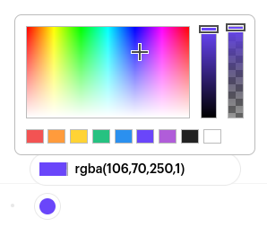

# Smiteboard
Userscript extension for Witeboard.

---

## Features

Press Smite [↯&#xFE0E;] in top left to open the actions menu, offering:
* Moor [⚓&#xFE0E;]:
  * Save the current state of the board as an SVG.
* Nuke [☢&#xFE0E;]:
  * Specialist tool for deleting vector paths from the board state.

In addition to that, a fully-fledged RGBA colorpicker replaces the old palette selector:

---

## Install

Use [Tampermonkey](https://www.tampermonkey.net/) or another analogous userscript manager to install.
